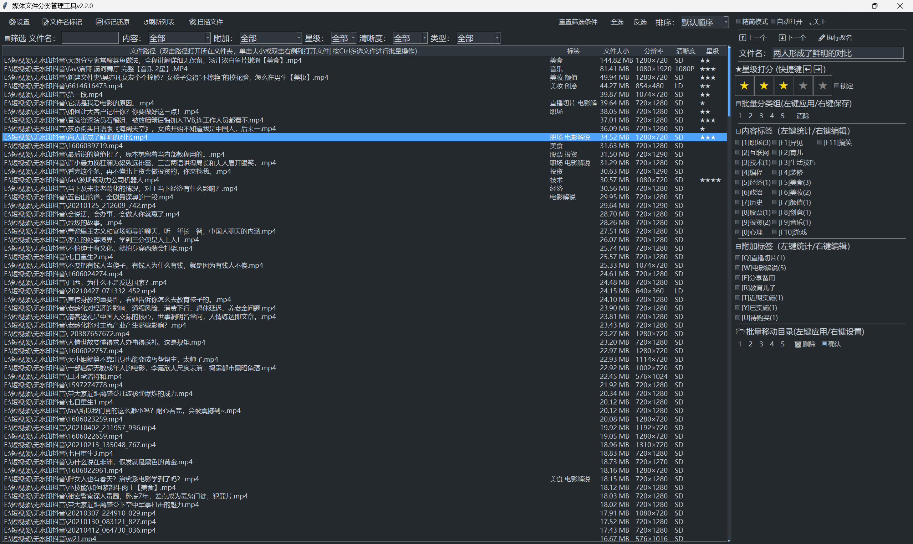
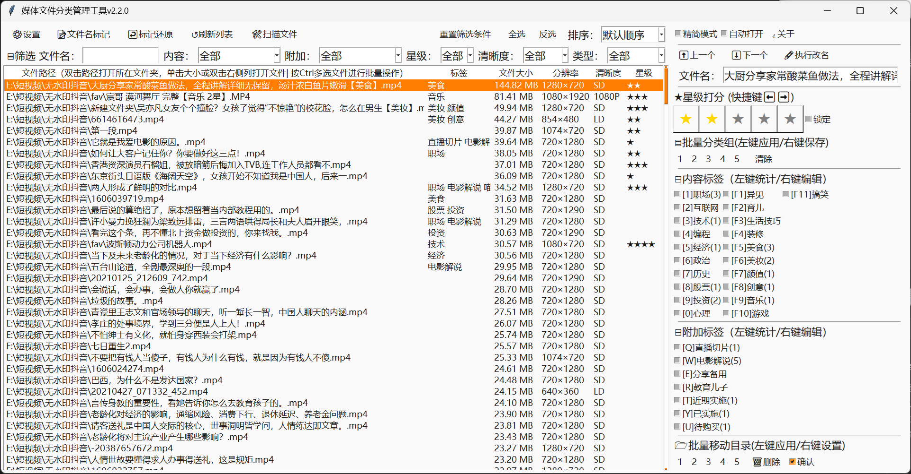
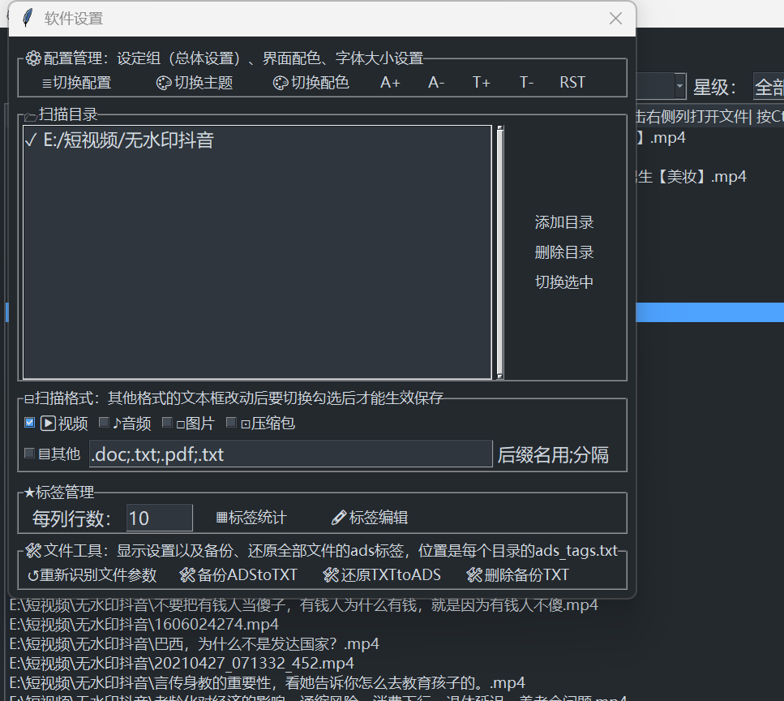
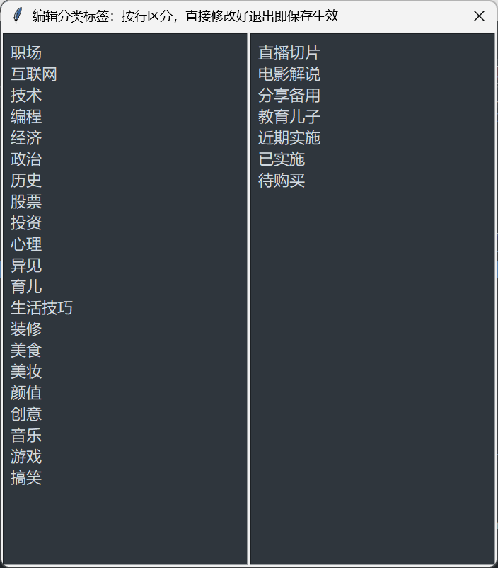

## 界面展示
### 主界面
| 深色模式 | 浅色模式 |
|----------|----------|
|  |  |

### 设置相关界面

# 核心功能
1、自动遍历自定义本地目录，区分视频 / 音频 / 图片 / 压缩包 / 自定义文档，调用 MediaInfo、Pillow 自动读取视频图片分辨率进行记录。
2、多维度标签与星级管理：自定义分容分类、附属附加标签库，五星评分标记资源；支持单选 / 批量修改标签、星级，数据持久化存入 ADS 或附属标签文件。
4、复合条件筛选检索：关键词 + 文件类型 + 清晰度 + 星级 + 内容分类 + 附加分类六维联动筛选，精准过滤目标素材。
5、批量命名 ：一键批量将【星级 + 内容 + 附加】拼接为文件名后缀；随时一键逆向剔除标签后缀，还原文件初始名称，方便结合文件管理器搜索转移。
6、标签统计盘点：自动统计在用标签频次，区分系统标准标签、游离无效标签，快速清理不规范标签，统一资源库分类规范。

# 更新记录

V2.2.1 优化备忘
1、修复bug逻辑bug
2、重构zen_toast、把tagcheck的refresh、toggle合二为一重构了
3、优化windwos的DPI处理，解决系统缩放导致的文字模糊
4、右侧打分、内容、附加分类右键点击都会调整筛选的条件，更方便使用
5、增加了ads标签里date的属性，存储文件创建时间，重写scan_media
6、分类标签增加了sep行，自动换列
7、去除掉兼容旧版本属性标签的版本代码，优化自动创建config的bug
8、下一步准备全代码重构优化

V2.2 实用版本:完善快捷键、单手操作、文件防护细节，版本完整可用，在使用中修复bug和优化功能
1.重新划分快捷键：F键+数字键控制主标签，字母键控制附加标签，按键分工更清晰（v2.2.0）
2.适配单手键盘操作：上下键切换文件、±键打分、回车键打开文件；精简界面下左右键可控制播放器进退（v2.2.0）
3.支持根据白天黑夜自动切换深浅色模式；自制弹窗提示框，解决原生弹窗不兼容深色模式的问题（v2.2.0）
4.自动清除文件只读属性，避免文件权限问题导致无法修改标签（v2.2.0）
5.新增文件锁定标签，锁定后的文件无法修改评分和分类，防止误操作改（v2.2.0）

v2.1.9 
1、UI优化，自制主题、配色、字体、切换模块
2、增加精简模式，仅显示打分标签功能界面，并置顶透明显示
3、优化标签统计、功能， 直接在右键点击窗口编辑，标签应用增加快捷键
4、优化多个模块

v2.1.8
1、优化UI，尝试切换CustomTkiter,难以优化已回滚
2、优化性能，进一步优化磁盘I/O批量读取功能的模块，尽量优化改为纯内存处理，仅读取变动项目
2、增加置顶小窗口实现快速打分

v2.1.7 
1、扫描目录的增加生效、禁用切换功能
2、优化布局、控件排版、文本，修复bug
3、整体代码优化、格式化

v2.1.6 基本稳定版本
1、修复多处BUG，提升整体运行稳定性
2、优化全局UI布局，统一所有控件排版、尺寸与字体样式
3、新增浅色/深色模式切换，支持日夜界面切换

v2.1.5 优化便捷操作
1、优化Treeview选中刷新机制，完善双击打开目录或打开文件
2、增设上一个/下一个快捷切换按钮，搭配独立勾选开关实现切完自动打开，适配单手批量处理流程
3、完善媒体扫描与列表刷新逻辑，尝试接入图片EXIF识别，因技术难度暂时简化适配
4、优化窗口焦点取回逻辑，解决播放器抢占焦点、快捷键失效问题

v2.1.4 优化便捷操作
1、优化NTFS-ADS标签写入逻辑，做到标签更新不改动文件原始修改时间
2、完善批量标签、星级编辑能力，全面支持单条/批量素材属性修改
3、修复部分特殊素材分辨率读取异常、信息缺失问题

v2.1.3 优化便捷操作
1、添加复合筛选体系，完善清晰度、星级、分类多条件联动检索
2、优化关键词模糊匹配算法，大幅提升素材检索精准度
3、新增全局键盘快捷键，支持快捷键快速评分、操作

v2.1.2
1、重写标签统计与盘点核心逻辑，可识别无效、游离标签，完善标签频次统计、标签规整清理功能
2、重构标签管理UI，实现界面组件复用，提升扩展性
v2.1.1
1、优化主界面布局，新增主界面快速重命名功能
2、升级批量打标重命名逻辑，强化容错机制，规避特殊字符、超长文件名报错
3、修复Toplevel弹窗残留问题，解决弹窗导致主窗口无法正常关闭的BUG
v2.1.0
1、新增快捷标签组 1-5、快捷移动目录 1-5，完善二次确认弹窗与执行逻辑
2、全局操作统一优化，全部功能支持单条操作与批量处理
3、新增ADS标签导出、备份与还原功能，解决跨分区、跨设备迁移难题
4、修复极端场景下文件标签数据丢失、读取异常的BUG

v2.0.0 架构重构版本
1、项目复杂度大幅提升，开发模式由面向豆包喊话转为面向电脑开发
2、全盘重构项目架构，优化全局代码逻辑与运行效率
3、磁盘IO全面优化，大量数据改用内存字典预加载，大幅提升扫描与检索速度
4、全新改版管理界面，统一功能布局，支持配置保存与快速切换
5、支持多场景方案切换，可快速切换不同目录组、标签组配置，适配多套素材库管理

v1.6.0
1、新增独立设置界面，全局配置统一收纳管理
2、优化软件整体界面布局与文字展示，统一交互逻辑，提升使用体验

v1.5.0
1、重构标签数据结构，旧题材/演员标签升级为【主内容标签+附加标签】、移除备注标签，
2、开发旧标签数据迁移兼容逻辑，完美兼容v1.0-v1.4历史素材数据
v1.4.0
1、软件定位升级：从小视频管理工具升级为多类型素材整理管理工具
2、新增音频、图片、压缩包、其他文档支持
3、新增目录管理模块，支持批量增删扫描目录
4、完善多格式文件识别、筛选、加载逻辑，统一全类型素材管理规范

v1.3.0
1、新增标签统计可视化和编辑面板，直观展示标签使用频次与分布
2、主界面组件支持自定义布局，界面可灵活定制适配个人习惯

v1.2.0
1、实现标签批量重命名，自动根据星级、标签拼接文件名
2、支持一键逆向还原原始文件名，方便文件迁移与分享
3、优化文件删除逻辑，增加校验与容错，规范素材删除流程

v1.1.0
1、新增多维度组合筛选功能，精准过滤素材库目标文件
2、标签存储体系升级为 NTFS-ADS 备用数据流方案
3、优化标签读写机制，不篡改文件本体、不改动文件属性，数据更安全稳定

v1.0.0 初始功能稳定版本
1、搭建软件基础运行框架，支持主流视频格式识别与解析
2、实现素材目录添加、手动重新扫描、列表刷新基础能力
3、标签体系：题材、演员、评分、备注四维度标签管理
